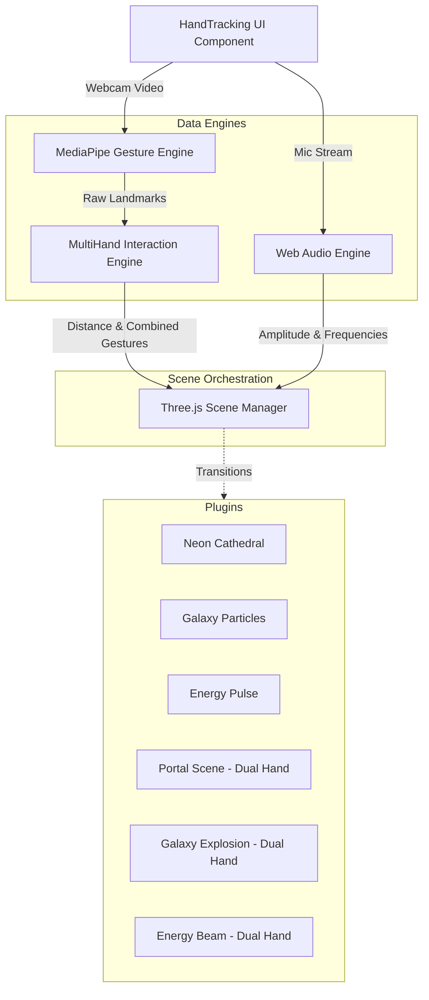

# AI Gesture Visualizer

[](https://nextjs.org/)
[](https://www.typescriptlang.org/)
[](https://threejs.org/)
[](https://developers.google.com/mediapipe)

AI Gesture Visualizer is a highly immersive, real-time web application that transforms human hand gestures into stunning 3D visual experiences. Built entirely with web technologies, it runs directly in your browser without the need for dedicated hardware.


---

## 🌟 Features

- **Real-Time Hand Tracking:** Utilizes Google's MediaPipe Tasks Vision models to track up to 2 hands at 30+ FPS.
- **Dual-Hand Combinations:** Combine gestures from both hands to unlock advanced interactions.
- **Audio Reactivity:** Integrates with the Web Audio API to scale and animate 3D effects based on microphone amplitude and frequency.
- **Dynamic 3D Scenes:** Powered by vanilla Three.js for robust memory management and pure WebGL performance.
- **Snapshot Export:** Capture high-resolution PNGs of your visual scenes instantly.

## 🏗 Architecture

The system is decoupled into specialized "Engines" that operate independently, feeding data downstream to the `SceneManager`.



## 🚀 Installation Guide

### Prerequisites
- Node.js 18.x or later
- npm or yarn

### Setup
1. Clone the repository:
   ```bash
   git clone https://github.com/anuragbraveboy-sudo/ai-gesture-visualizer.git
   cd ai-gesture-visualizer
   ```

2. Install dependencies:
   ```bash
   npm install
   ```

3. Start the development server:
   ```bash
   npm run dev
   ```

4. Open your browser and navigate to `http://localhost:3000`.
   Website : https://ai-gesture-visualizer.vercel.app/


## 🎮 Usage Guide

Upon opening the application:
1. **Allow Camera Access**: Necessary for MediaPipe to track your hands.
2. **Enable Microphone (Optional)**: Click the **🎤 Enable Mic** button at the top right to allow scenes to pulse with your voice or music.
3. **Show Gestures** to trigger scenes:
   - **Open Palm**: Neon Cathedral
   - **Peace Sign**: Galaxy Particles
   - **Thumbs Up**: Energy Pulse
4. **Use Two Hands** for combined effects:
   - **Palm + Palm**: Swirling Portal Scene
   - **Peace + Peace**: Exploding Galaxy
   - **Palm + Thumbs Up**: Distance Energy Beam
5. **Adjust Distance**: Move your hands closer or further apart to dynamically scale the intensity and size of the active scene!


## 🗺 Roadmap

- [ ] **Custom Gesture Training:** Allow users to record their own gestures and map them to scenes.
- [ ] **Record/Playback Engine:** Save a session of hand movements and audio to a JSON file and replay it in 3D.
- [ ] **WebXR Integration:** Bring the Three.js scenes into Virtual Reality using standard WebXR APIs.
- [ ] **Scene Creator UI:** Let users tweak colors, geometries, and speeds via a GUI.

## 🤝 Contributor Guide

We welcome contributions to expand the visual engine! 

### Creating a New Scene
1. Create a new file in `lib/scenes/` extending `BaseScene.ts`.
2. Implement the `onInit()` lifecycle method to create your Three.js meshes.
3. Implement `update(time, delta, handState, audioState)` to animate your meshes.
4. Register your scene in `lib/engine/SceneManager.ts` inside the `SCENE_PLUGINS` array.

### Development Standards
- Ensure `npm run lint` passes before submitting a PR.
- Use strict TypeScript typing for all Engine and Scene architectures.
- Ensure all Three.js geometries and materials are properly disposed of in `BaseScene.dispose()` to prevent WebGL memory leaks.

---

*Built with Next.js and Three.js.*
